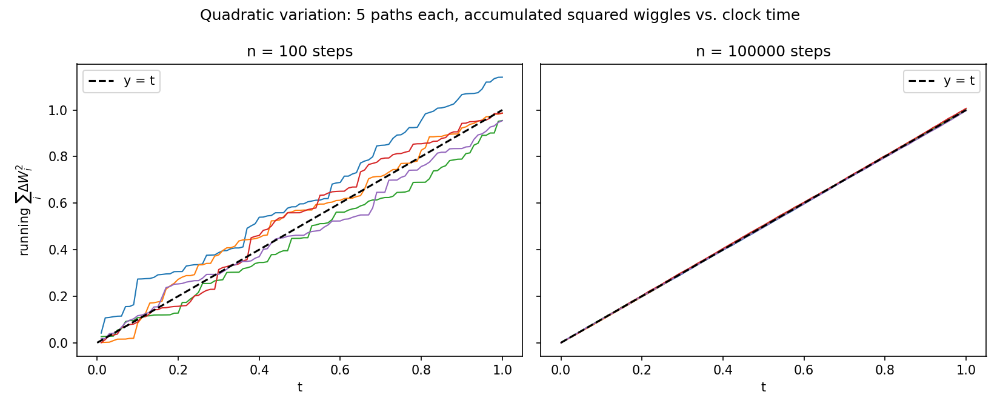

# 02 - New Calculus

Recall that Brownian motion is a continuous time stochastic process with the following properties:

- $W_0 = 0$
- $t \mapsto W_t$ w.p.$1$. (almost surely continuous sample paths)
- $W_t - W_s \sim \mathcal{N}(0, t - s)$ for $0 \leq s < t$.
- Independent increments (non-overlapping time intervals) are statistically independent.

We also defined the Itô Integral as

$$
\int_{0}^t X_s dW_s = \lim_{n \to \infty} \sum_{i = 1}^n X_{i - 1} \Delta W_i
$$

The integrand is evaluated at the left end-point of each infinitesimal interval (meeting our non-anticipation assumption).

However, what happens if $X_s$ itself is a random process (as opposed to a constant function)?

## Motivation

Consider:

$$
\int_0^t W_s dW_s = \lim_{n \to \infty} \sum_{i = 1}^n W_{i - 1} \Delta W_i = \lim_{n \to \infty} S_n
$$

First, recall that $\Delta W_i = W_i - W_{i - 1}$. Consider:

$$
W_{i}^2 = (\Delta W_i + W_{i - 1})^2 = \Delta W_i^2 + 2 W_{i - 1} \Delta W_i + W_{i - 1}^2
$$

Then, we can isolate

$$
W_{i - 1} \Delta W_i = \frac{1}{2} [W_{i}^2 - W_{i - 1}^2 - \Delta W_i^2]
$$

Then, our integral becomes:

$$
S_n = \frac{1}{2} \sum_{i = 1}^n (W_i^2 - W_{i - 1}^2) - \frac{1}{2} \sum_{i = 1}^n \Delta W_i^2
$$

The first sum telescopes to $W_n^2 - W_0^2 = W_t^2$. But what about $Q_n := \sum_{i = 1}^n \Delta W_i^2$?

Recall that

$$
\Delta W_i \sim_{i.i.d.} \mathcal{N}(0, \Delta t)
$$

So $Q_n$ is the sum of squared Gaussian i.i.d. RVs. This is the *chi-squared* distribution.

$$
Q_n = \sum_{i = 1}^n \Delta W_i^2 \sim \Delta t \cdot \chi^2(n)
$$

Two properties of the Chi-squared distribution are that $\mathbb{E}[\chi_n^2] = n$ and $\text{Var}(\chi_n^2) = 2n$. So we can recover that:

$$
\mathbb{E}[Q_n] = n \Delta t = t \text{ since $n$ is the number of total time increments}
$$

$$
\text{Var}(Q_n) = 2n \Delta t^2 = 2 t \Delta t
$$

As $n \to \infty$, we can see that $\mathbb{E}[Q_n]$ doesn't depend on $n$ but since $n$ controls the size of $\Delta t$, $\Delta t \to 0$ and the mean-square limit of $Q_n$ is $t$.

(Recall that mean square limit of a sequence of random variables is a RV such that the expected square difference with the sequence goes to $0$ as the sequence grows)

In short, the first sum is $ \frac{1}{2} W_t^2$ and the 2nd sum converges to $\frac{1}{2} t$.

By the definition of Ito integrals,

$$
\int_0^2 W_s dW_s = \frac{1}{2} W_t^2 - \frac{1}{2} t
$$

This is not regular calculus - naive integration produces the first term but not the 2nd!

Doing a left Riemann sum as an approximation to an integral produces an error on the order of $O(\Delta x)$ which tends to $0$ as the partition grows finer. The proof for why the $2$nd order terms go to $0$ involve both the mean-value theorem and the extreme value theorem which assume continuity and bounds the derivative. However, Brownian motion is non-differentiable! That's why sample paths are so jagged and why we need a new calculus.

### Another View

Another reason why $\int_0^t W_s dW_s = \frac{1}{2} W_t^2 - \frac{1}{2} t$ is that $\mathbb{E}[Y_t] = 0$. We will show this but recall that Since $X_i$ is non-anticipatory, it contains zero information about $\Delta W_{i + 1}$ (and hence they are orthogonal). $Y_t$ is called a **martingale** or a fair game.

Heuristically,

$$
\mathbb{E}[\sum_{i = 1}^n X_{i - 1} \Delta W_i] = \sum_{i = 1} \mathbb{E}[X_{i - 1}] \mathbb{E}[\Delta W_i] = 0
$$

Then, as $n \to \infty$, $\mathbb{E}[Y_t] = 0$ for all $t > 0$.

So,

$$
\mathbb{E}[\int_0^t W_s dW_s] = \mathbb{E} [\frac{1}{2} W_t^2 - \frac{1}{2} t]
$$

$$
= 0
$$

The expectation of $W_t^2$ is just the variance of $W_t$ which is normally distributed as $mathcal{N}(0, t)$. So the $\frac{1}{2} t$ "has to" exist to produce an expectation of $0$.

## The Heart

We observe that $\text{l.i.m} \sum_{i = 1}^n \Delta W_i^2 = t$. So we can write this as:

$$
\int_0^t dW_s^2 = t
$$

By applying FTC, we recover $dW_t^2 = dt$. This cannot be taken literally - squared increment of Brownian motion does not equal to time increment.

## $dW_t^2 = dt$

Suppose $\mathbb{E}[G_s^2] < M$ for all $s \in [t_0, t]$ for some constant $M > 0$. Then, we have:

$$
\int_{t_0}^t G_s dW_s^2 := \text{l.i.m.} \sum_{i = 1}^n G_{i - 1} \Delta W_i^2
$$

Theorem: This mean-square limits is equal to $\int_{t_0}^t G_s ds$ where $ds$ is an ordinary differential.

## Intuition

Consider a time-interval sliced $0 \leq t_0 < t_1 < \dots < t_n = T$.

$$
\int_0^T G_s ds \approx \sum_i G_{t_i} (t_{i + 1} - t_i) = \sum_i G_{t_i} \Delta t
$$

$$
\int_0^T G_s dW_s^2 \approx \sum_i G_{t_i} (W_{t_{i + 1}} - W_{t_i}) = \sum_i G_{t_i} \Delta W_i^2
$$

On a single slice, $\Delta W_i \sim \mathcal{N}(0, \Delta t)$. Each random increment has mean square $\Delta t$: $\mathbb{E}[\Delta W_i^2] = \Delta t$. Each $\Delta W_i^2$ is not exactly $\Delta t$ but if you sum them, the sum's variance becomes linear in $\Delta t$ and goes to $0$ as $n \to \infty$.

The errors of the square wiggles $\Delta W_i^2 - \Delta t$ as the slice length decreases (and wiggle frequency increases) are very unlikely to be all positive or all negative - hence why we can estimate $t$ just by summing $\Delta W_i^2$.

