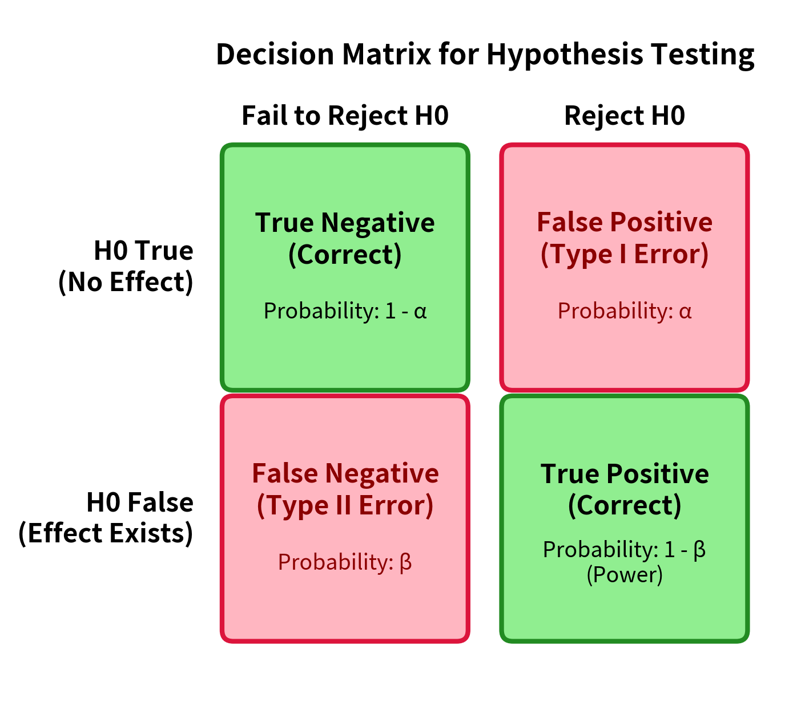
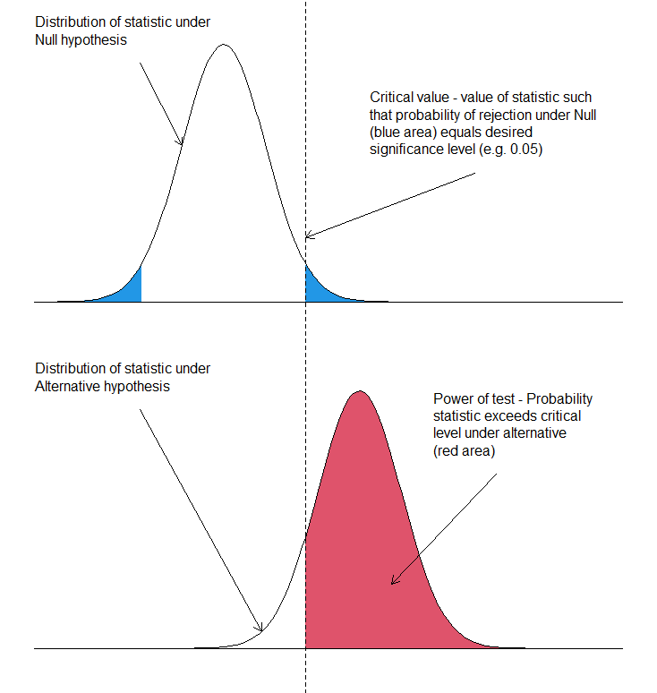

# Hypothesis Testing

## Introduction

A *hypothesis* is a statement about a population parameter.

!!! info "Definition: Complementary Hypotheses"
    The two complementary hypotheses in hypothesis testing are called the *null hypothesis* and the *alternative hypothesis* written as $H_0$, $H_1$. The alternative can also be written as $H_A$.

If $\theta$ is a population parameter, then $H_0 = \{\theta \in \Theta_0\}$ and $H_1 = \{\theta \in \Theta_0^C\}$.

!!! example "Example: Drugs"
    If $\theta$ denotes the average change in a patient's blood pressure after taking a drug, an experimenter would likely by interested in testing $H_0: \theta = 0$ vs $H_1: \theta \neq 0$.

    The null states that on average, the drug doesn't affect blood pressure whereas the alternative states that there is some effect. The common situation is that $H_0$ states that the treatment has no effect, hence why it is called the "null" hypothesis.

The alternative $H_1$ (or $H_A$) can be one-sided (specifying that the treatment effect is positive) or two-sided (specifying that the treatment effect exists whether positive or negative).

!!! info "Definition: Hypothesis Test"
    A **hypothesis test** is a rule that specifies for which sample values the decision is made to accept $H_0$ as true vs where $H_0$ is rejected and $H_1$ is accepted as true.

We can sidestep the philosophical discussion of accepting $H_1$ as opposed to "rejecting the null".

Typically, a *test statistic* $W(X_1, \dots, X_n) = W(\mathbf{X})$ is a function of the sample. A test might specify that $H_0$ is to be rejected if $W(\mathbf{X}) = \bar{X}$, the sample mean, is greater than $10$. Here, test statistic is the sample mean and the rejection region is $\{(x_1, \dots, x_n): \bar{x} > 10\}$.

## Methods of Finding Tests

### Likelihood Ratio

Recall that if $X_1, \dots, X_n$ is a random sample from a population with distribution $f(x \mid \theta)$, the likelihood function is:

$$
L(\theta \mid x_1, \dots, x_n) = L(\theta, \mathbf{x}) = f(\mathbf{x} \mid \theta) = \prod_{i = 1}^n f(x_i \mid \theta)
$$

!!! info "Definition: Likelihood Ratio Test Statistic"
    Let $\Theta$ denote the parameter space. Then, the *likelihood ratio test statistic* for testing $H_0: \theta \in \Theta_0$ versus $H_1: \theta \in \Theta_0^C$ is

    $$
    \lambda(\mathbf{x}) = \frac{\sup_{\Theta_0} L(\theta \mid \mathbf{x})}{\sup_{\Theta} L(\theta \mid \mathbf{x})}
    $$

    A *likelihood ratio test* is any test with a rejection region of the form $\{\mathbf{x} : \lambda(\mathbf{x}) \leq c\}$ where $0 \leq c \leq 1$.

In the discrete case, the numerator is the maximum probability of the observed sample under the null hypothesis while the denominator is the maximum probability of the observed sample over all possible parameters.

This ratio is small when there are points in the alternative hypothesis space where the observed sample is much more likely. When this ratio is close to $1$, the null hypothesis space produces as good (or nearly as good) likelihoods for the observed sample.

This is essentially computing the ratio of maximum likelihoods.

### Bayesian Tests

We use the posterior distribution $\pi(\theta \mid \mathbf{x})$ to calculate the probabilities that $H_0, H_1$ are true. Recall $\pi(\theta \mid \mathbf{x})$ is a probability distribution over a random variable. The posterior probabilities, $P(\theta \in \Theta_0 \mid \mathbf{x}), P(\theta \in \Theta_0^C \mid \mathbf{x})$ can be computed.

A Bayesian hypothesis tester can choose to accept $H_0$ as true if $P(\theta \in \Theta_0 \mid \mathbf{X}) \geq P(\theta \in \Theta_0^C \mid \mathbf{X})$. If the tester wishes to guard against false rejections, the tester can reject $H_0$ only if $P(\theta \in \Theta_0^C \mid \mathbf{X})$ is greater than some large number.

## Evaluating Tests

### Power, Errors

!!! info "Definition: Errors"
    Recall that accepting $H_1$ typically connotes accepting that a treatment had some "positive" effect, not necessarily in the normative sense but in the sense that it did *something*. A **false positive** (Type I Error) corresponds to rejecting $H_0$ when $H_0$ is true and a **false negative** (Type II Error) corresponds to "accepting" $H_0$ when $H_1$ is true.

Suppose $R$ represents the rejection region of a test (rejection of the null). For $\theta \in \Theta_0$, the probability of a false positive (Type I Error) is $P_{\theta}(\mathbf{X} \in R)$. For $\theta \in \Theta_0^C$, the probability of a false negative (Type II Error) is $P_{\theta}(\mathbf{X} \in R^C) = 1 - P_{\theta}(\mathbf{X} \in R)$.

This leads to the following definition (and procedure):

!!! info "Definition: Power Function"
    The *power function* of a hypothesis test with a rejection region $R$ is a function of $\theta$, $\beta(\theta) = P_{\theta}(\mathbf{X} \in R)$.

With a finite sample, it is difficult to choose a test which minimizes the probability of both Type I and Type II Errors. Accordingly, we typically try to restrict the probability of a false positive to a *size* or *level* frequently called $\alpha$.

!!! info "Definition: Level"
    For $0 \leq \alpha \leq 1$, a test with power function $\beta(\theta)$ is a level $\alpha$ test if $\sup_{\theta \in \Theta_0} \beta(\theta) \leq \alpha$.

The level $\alpha$ is essentially the tolerance that we have for a Type 1 Error (false positive). Recall that the power function is the probability of rejecting the null. Then, the level of a test is the probability of falsely rejecting the null (a false positive).

(There is a slight difference between *level* and *size* which I am currently ignoring).

The accepted false positive tolerance rate defines the rejection region, bounded by various critical values $c$. Then, the *statistical power* of a test is the probability that the test statistic exceeds $c$ when $\theta \in \Theta_0^C$.

So in short:

1. We devise some statistic $t(\mathbf{x})$ to test between two hypotheses $H_0, H_A$.

2. We specify a significance level $\alpha$ - our tolerance for false positives (incorrectly rejecting the null).

3. $\alpha$ constrains a rejection region bounded by $c$. $c$ "shaves off" the tail(s) of the sampling distribution of $t(\mathbf{x})$ under $H_0$.

4. The statistical power of our test (against a specific $\theta$) is then (w.l.o.g.) the probability $P_{\theta}(t(\mathbf{x}) > c | \theta \in \Theta_0^C)$ - in other words, the probability of correctly accepting the alternative (with being at most $\alpha$ likely to falsely reject the null).

In the $4$th step, power is a function defined over the parameter space - so we frequently observe power curves as opposed to a single number.