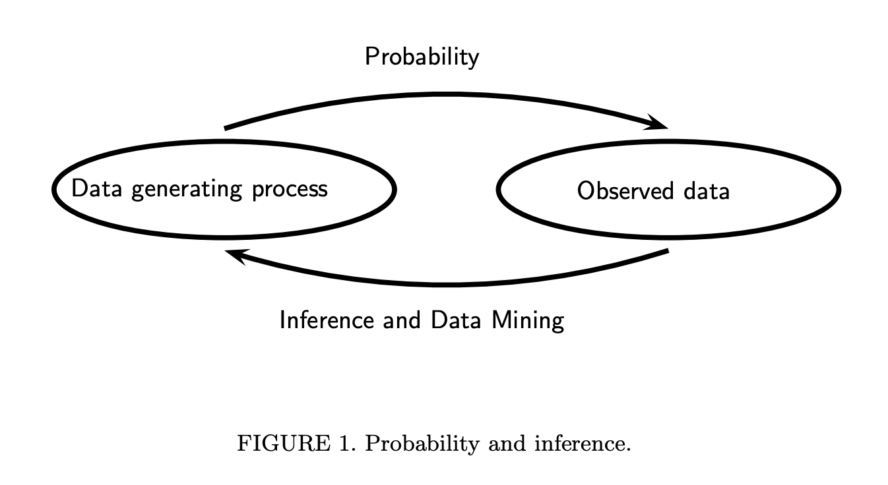

# Statistics

Statistics is the practice of drawing inferences from data.

In probability, we learn about various probability distributions. In the statistical inference setting, we are blind to the distribution, its family and its parameters. With a finite sample of data, we are frequently doing one of several things:

- Computing *descriptive* statistics such as the mode, mean, or median.
- Inferring *population* parameters from the finite sample using *estimators*.
- Developing *models* to approximate the (assumed) data generating process.
- Developing *hypotheses* and testing them.

Since almost everything in statistics is a function of a data sample, all of these statistics are random variables themselves. The distribution of the statistic is called the *sampling distribution*.

Preferably, an estimator should be:
- unbiased
- low variance
- consistent

Here, we have several note pages taken from predominantly from "Statistical Inference" by Casella and Berger.

1. [Random Samples](random_samples.md). We review and derive common sample statistics and modes of convergence.
2. [Point Estimation](point_estimation.md). We look at a few point estimators.
3. [Hypothesis Testing](hypothesis_testing.md). We review the Fisher school of hypothesis testing.
4. Interval Estimation. We review the Fisher school of hypothesis testing.
5. Basic Asymptotics.
6. ANOVA.

TODO:

- Work out exercises
- Hypothesis Testing chapter

Citations:
- Casella, G., & Berger, R. (2024). Statistical Inference (2nd ed.). Chapman and Hall/CRC. https://doi.org/10.1201/9781003456285
- Wasserman, L. (2013). All of Statistics: A Concise Course in Statistical Inference. Springer Science & Business Media.